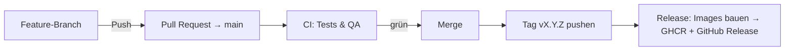

# 📄 DocuMind

[](LICENSE)

**DocuMind** is an open-source RAG (Retrieval-Augmented Generation) backend for companies whose documents live in non-standardized DMS, ERP, or industry solutions. It brings automatic document classification, smart tagging, and semantic search using OpenAI-compatible APIs and Ollama.

It enables **fully automated document workflows**, **contextual chat**, and **powerful customization** — all via an intuitive web interface.

> 💡 Just ask:  
> “When did I sign my rental agreement?”  
> “What was the amount of the last electricity bill?”  
> “Which documents mention my health insurance?”  

Powered by **Retrieval-Augmented Generation (RAG)**, you can now search semantically across your full archive and get precise, natural language answers.

---

## ✨ Features

### 🔌 DMS-Agnostic Connector Layer
- Connector interface for any DMS/ERP source — Paperless-ngx is the reference connector
- Normalized document model (`DocumentRecord`, `DocumentContent`) keeps the rest of the app source-agnostic
- Registry + factory pattern: new connectors are added without touching selection logic

### 🔄 Automated Document Processing
- Detects new documents in your DMS automatically
- Analyzes content using OpenAI API, Ollama, and other compatible backends
- Assigns title, tags, document type, and correspondent
- Built-in support for:
  - Ollama (Mistral, Llama, Phi-3, Gemma-2)
  - OpenAI
  - DeepSeek.ai
  - OpenRouter.ai
  - Perplexity.ai
  - Together.ai
  - LiteLLM
  - VLLM
  - Fastchat
  - Gemini (Google)
  - ...and more!

### 🧠 RAG-Based AI Chat
- Natural language document search and Q&A
- Understands full document context (not just keywords)
- Semantic memory powered by your own data
- Fast, intelligent, privacy-friendly document queries

### 🏗️ Modern Monorepo Architecture
- pnpm + Turbo workspace (`apps/*` + `packages/*`)
- NestJS 10 backend (`apps/backend`, port 3001)
- Vite 6 + React 18 frontend (`apps/frontend`, port 3000)
- Python pipelines (FastAPI): Ingestion (8001), Retrieval (8002), Generation (8003)
- Direct HTTP REST communication between backend and pipelines (FastAPI)
- Vector-DB factory: Chroma / Qdrant / PGVector
- TypeScript 7 (native Go compiler) across the monorepo — the backend stays on TS 5.9 for NestJS toolchain compatibility

---

## 🚀 Installation

### ⚡ One-Liner (empfohlen)

Der interaktive Installer klont das Repo, fragt die Stack-Typen ab (DMS,
VectorDB neu/bestehend, LLM), schreibt eine vollständige `.env` und startet den
kompletten Stack über reguläre `docker`-Befehle (kein docker compose). Die
App-Images werden aus der GitHub Container Registry (GHCR) gepullt.

```bash
wget -qO- https://raw.githubusercontent.com/chris576/documind/main/install.sh | bash
# oder
curl -fsSL https://raw.githubusercontent.com/chris576/documind/main/install.sh | bash
```

Der Installer unterstützt:

- **DMS**: Paperless-ngx (funktionsfähig) / Docspell (Platzhalter)
- **VectorDB**: Chroma, Qdrant oder PGVector — jeweils **neu anlegen** (Container
  wird gestartet) oder **bestehende Verbindung** nutzen (z. B. Paperless-Postgres
  als PGVector, sofern die `vector`-Extension installiert ist)
- **LLM**: OpenAI, Ollama, Anthropic oder Custom (OpenAI-kompatibel)
- **Hybrid-Suche**: Keyword-Methode je DB (auto/native/fts/local) + Gewichtung

Nach der Installation:

```bash
bash start.sh    # Stack starten
bash stop.sh     # Stack stoppen (Volumes bleiben)
bash update.sh   # Neue Images pullen + App-Container neu erstellen
```

### 🐳 Manuell (Docker)

```bash
git clone https://github.com/chris576/documind.git
cd documind
cp .env.example .env
# Werte anpassen (PAPERLESS_API_URL, PAPERLESS_API_TOKEN, JWT_SECRET, ...)
bash start.sh
```

Services:

| Service | URL / Port |
|---|---|
| Frontend | http://localhost:3000 |
| Backend (NestJS) | http://localhost:3001 |
| Ingestion pipeline | http://localhost:8001 |
| Retrieval pipeline | http://localhost:8002 |
| Generation pipeline | http://localhost:8003 |
| PostgreSQL | 5432 |
| ChromaDB | 8000 |

### 🔧 Local Development

```bash
# Install dependencies
pnpm install

# Start all services in watch mode
pnpm dev

# Build all packages
pnpm build

# Type-check all packages
pnpm typecheck
```

---

## 🔄 CI/CD & Releases

Der Workflow folgt dem **GitHub-Flow**: Direkter Push auf `main` ist verboten.
Entwicklung läuft über Feature-Branches und Pull Requests.



### Ablauf

1. **Feature-Branch** erstellen: `git checkout -b feature/mein-feature`
2. **Pull Request** gegen `main` öffnen → `ci.yml` läuft automatisch:
   - **TypeScript**: `pnpm lint`, `pnpm typecheck`, `pnpm build`, `pnpm test`
   - **Python**: `infrastructure/scripts/test-pipelines.sh all`
     (ruff, mypy, bandit, pytest mit Coverage ≥ 75 %)
3. **Merge** erst nach grünen Checks.
4. **Release auslösen** (Tag auf `main`):
   ```bash
   git tag v1.2.3
   git push origin v1.2.3
   ```
   `release.yml` baut alle 5 Images, pusht sie nach GHCR
   (`ghcr.io/chris576/documind/<service>:<version>` + `:latest`) und legt ein
   GitHub Release mit Changelog an.

### Branch-Protection (GitHub-Settings)

In **Settings → Branches → Add rule** für `main` aktivieren:

- ✅ **Require a pull request before merging**
- ✅ **Require status checks to pass before merging** → `TypeScript Quality Gates` und `Python Quality Gates` (Namen der Jobs aus `ci.yml`)
- ✅ **Do not allow bypassing the above settings**
- ❌ **Allow force pushes** deaktiviert
- ❌ **Allow deletions** deaktiviert

### GHCR-Images

| Service | Image |
|---|---|
| Backend | `ghcr.io/chris576/documind/backend` |
| Frontend | `ghcr.io/chris576/documind/frontend` |
| Ingestion | `ghcr.io/chris576/documind/ingestion-pipeline` |
| Retrieval | `ghcr.io/chris576/documind/retrieval-pipeline` |
| Generation | `ghcr.io/chris576/documind/generation-pipeline` |

Tags: `<version>` (z. B. `v1.2.3` → `1.2.3`) und `latest`.

---

## 🧭 Roadmap Highlights

- ✅ DMS-agnostic connector layer (Paperless-ngx reference connector)
- ✅ Multi-AI model support
- ✅ Multilingual document analysis
- ✅ Integrated document chat with RAG
- ✅ Vector-DB factory (Chroma / Qdrant / PGVector)
- 🚧 MCP server for agent access (Hermes, OpenClaw, …)
- 🚧 Additional connectors (generic REST/OData, Nextcloud/WebDAV, ELO, d.velop, windream, DATEV)

---

## 🤝 Contributing

We welcome PRs and contributions!

```bash
# Fork, clone, then:
git checkout -b feature/YourFeature
# After changes:
git commit -m "Add YourFeature"
git push origin feature/YourFeature
```

Then open a Pull Request via GitHub.

---

## 📄 License

This project is licensed under the MIT License. See [LICENSE](LICENSE) for details.
